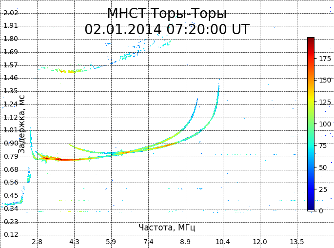
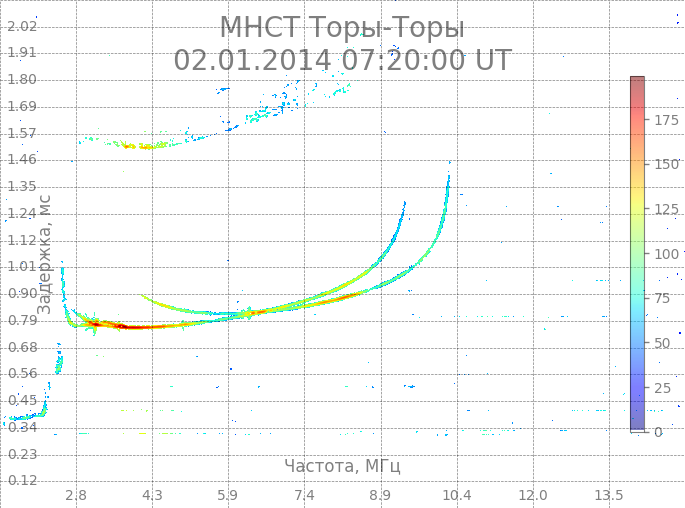
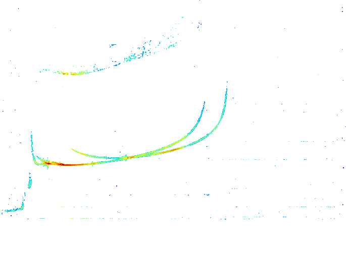

# ionogram_visualizer
Библиотека для отрисовки ионограмм в картинки подходящие для разметки датасетов.

## Примеры визуализации

### 1. Полностью непрозрачные подписи (alpha=1.0)

*Параметры: alpha=1.0, dpi=100, scale=1*

### 2. Полупрозрачные подписи (alpha=0.5)

*Параметры: alpha=0.5, dpi=100, scale=1*

### 3. Без подписей (alpha=0.0)

*Параметры: alpha=0.0, dpi=100, scale=1*

## Пример использования
```python
from ionogram_visualizer import IonogramVisualizer, SimpleIonogramArrayBuilder
import ionread_python as ionread

# Загрузка данных
ionogram = ionread.read_ionogram('test_data/01_02_07_20_00.dat')

# Создание массива ионограммы
builder = SimpleIonogramArrayBuilder(ionogram).process()
ionogram_array = builder.get_ndarray()

# Визуализация
visualizer = IonogramVisualizer()
visualizer.show_ionogram(
    ionogram,               # Данные ионограммы
    ionogram_array,         # Массив для визуализации
    path="result.png",      # Путь для сохранения
    alphas=1.0,            # Прозрачность подписей (0.0-1.0)
    dpi=100,               # Разрешение изображения
    colorbar = True        # Показывать цыетовую шкалу или нет
    scale=1                # Масштаб относительно исходного массива
)
```

## Использование через командную строку
```
python script.py test_data/01_02_07_20_00.dat --alpha 0.8 --dpi 300 --scale 1 --output result.png
```
### Параметры:
- file_path - Путь к входному .dat файлу с данными ионограммы

- --alpha GRID_ALPHA - Прозрачность подписей (0.0 - прозрачная, 1.0 - непрозрачная)

- --dpi DPI - Разрешение изображения в DPI (точек на дюйм)

- --scale - Масштаб изображения относительно исходного массива

- --output OUTPUT - Путь для сохранения изображения (по умолчанию: fullscreen_ionogram.png)

## Установка 
### Устанавливаем билиотеку ionread_python 
Коланируем репозиторий 
```
git clone https://git.iszf.irk.ru/data-mapping/ionogram-wrappers.git
```
Переходим в папку 
```
cd ionogram-wrappers/src/ionread_python
```
Устанавливаем 
```
pip instal ./
```
### Устанавливаем бибилотеку 
Коланируем репозиторий 
```
git clone https://github.com/Daniil138/ionogram_show.git
```
Переходим в папку 
```
cd ionogram_show
```
Устанавливаем 
```
pip instal ./
```
