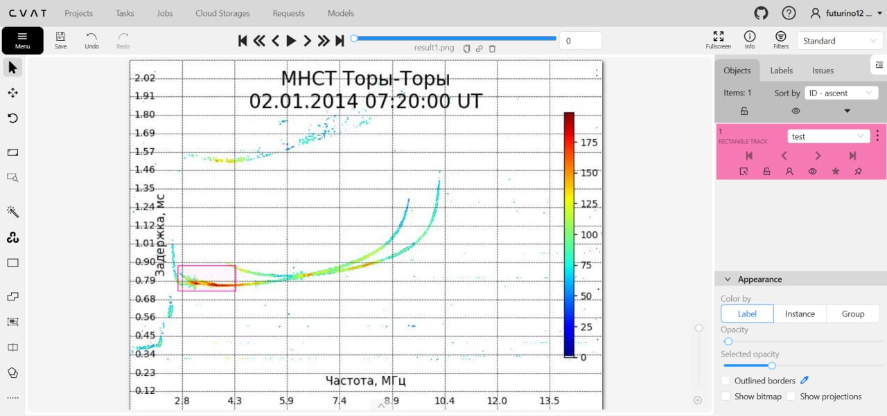
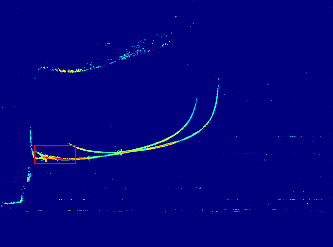

# Валидация

## Используя CVAT я разметил одну картинку и получил координаты 

1. **Исходное изображение с разметкой**  
     
   На этой картинке показана исходная ионограмма с выделенной областью интереса (bounding box), размеченной в CVAT.

2. **Результат после обрезки**  
     
   Здесь представлен результат после обрезки данных по выделенной области.

- В **CVAT** координаты начинаются из **верхнего левого угла** (ось Y направлена вниз)
- В **Matplotlib** координаты начинаются из **нижнего левого угла** (ось Y направлена вверх)

Поэтому при работе с данными из CVAT необходимо инвертировать ось Y. Полученные результаты подтверждают, что наша библиотека корректно преобразует ионограммы в изображения и правильно работает с координатами.